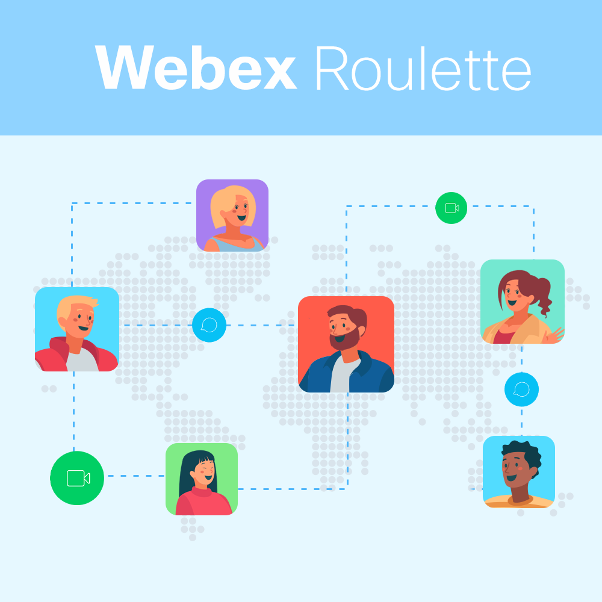
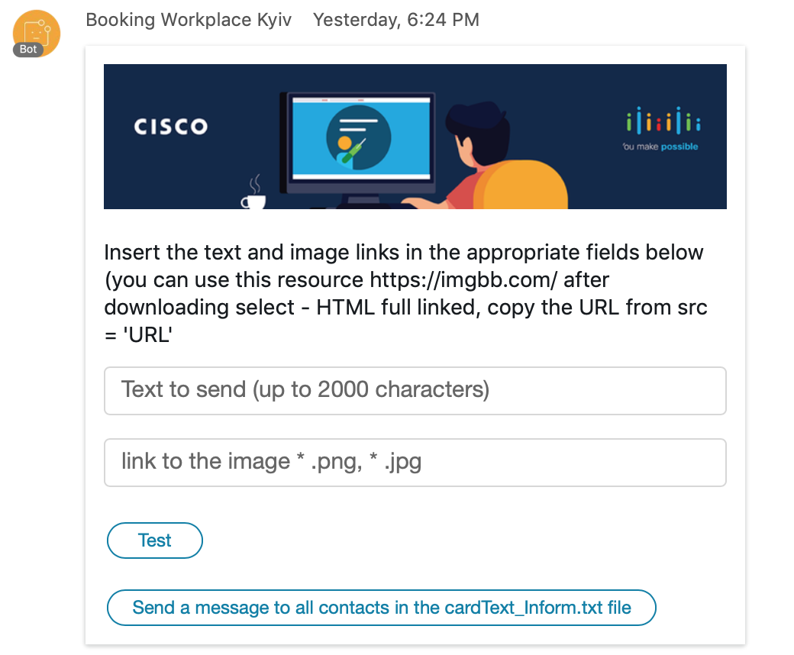
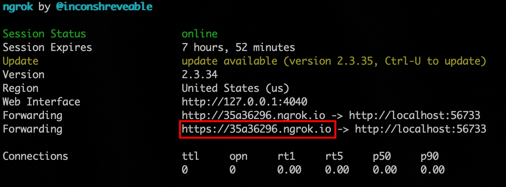
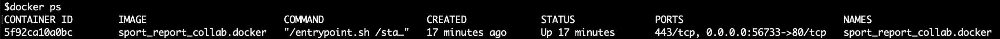
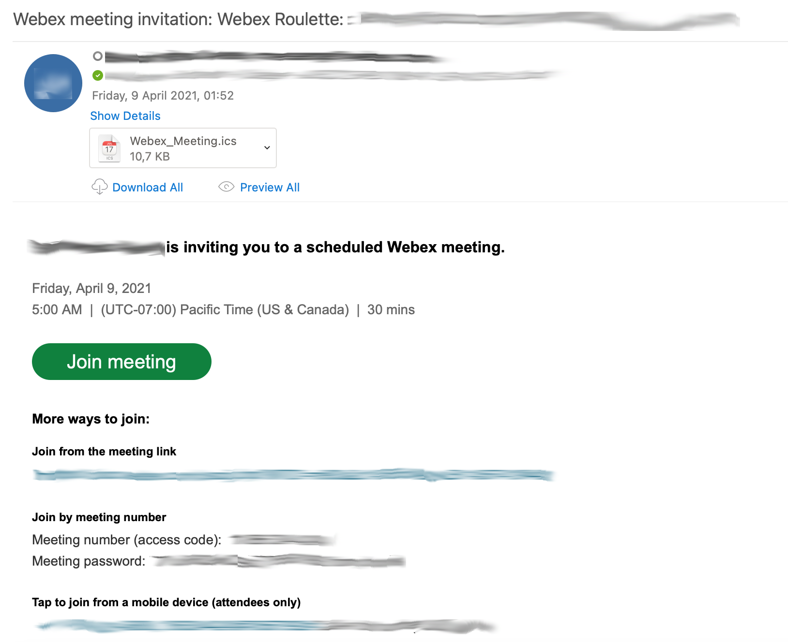
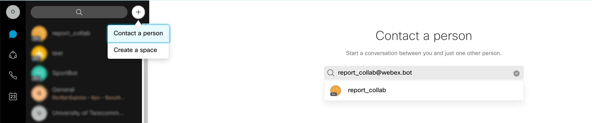
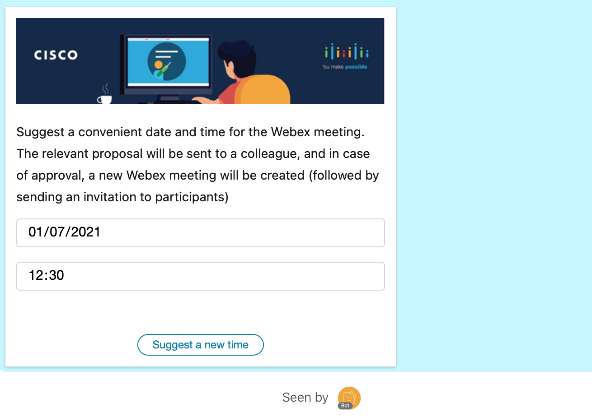
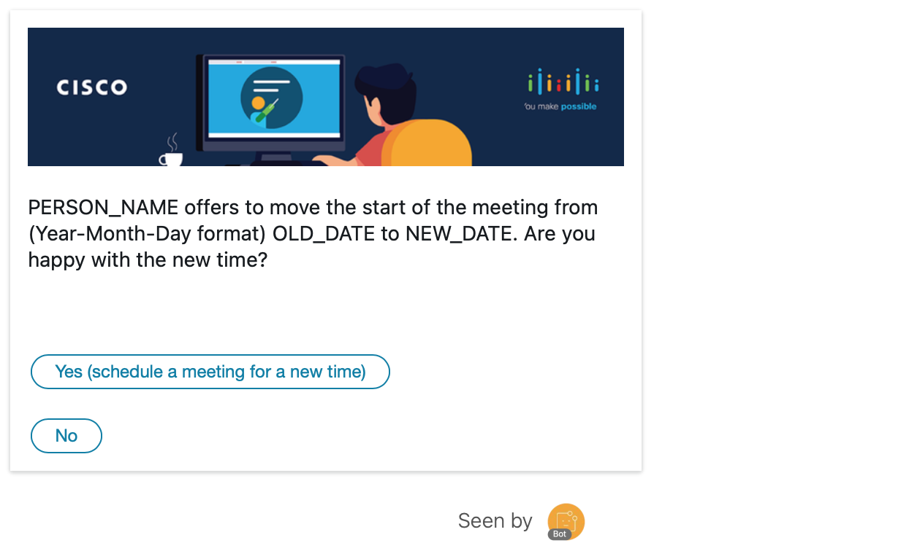

# Webex Roullete

This solution can help you to create unique pairs for meetings for one mount. And schedule appointments (meetings) for these pairs for a specific date and time each week.

Webex Roullete help to connect remote workers/distributed teams by schedule special recurring meetings (once per week). App help generates the set of unique pairs of colleagues. The solution gets connected employees that do not often connect, from different departments, etc.




### Structure

  - [Requirements](#Requirements)
  - [Adaptive_cards](#Adaptive_cards)
  - [Deployment](#Deployment)
- [Description](#Description)


### Requirements
- [Python](https://www.python.org/downloads/)
- [Docker](https://www.docker.com/get-started)

### Adaptive cards

**How works with adaptive cards**

#### Creating a webhooks 

For reading data from users after Adaptive Card interaction and sending messages, we create two webhooks:

```
def createWebhook(bearer, webhookUrl):
    hook = True
    botWebhooks = send_webex_get("https://webexapis.com/v1/webhooks")["items"]
    for webhook in botWebhooks:
        if webhook["targetUrl"] == webhookUrl:
            hook = False
    if hook:
        dataWebhook = {
        "name": "Messages collab bot Webhook",
        "resource": "messages",
        "event": "created",
        "targetUrl": webhookUrl
        }
        dataWebhookCard = {
            "name": "Card Report collab bot Webhook",
            "targetUrl": webhookUrl,
            "resource": "attachmentActions",
            "event": "created"
        }
        send_webex_post("https://api.ciscospark.com/v1/webhooks/", dataWebhook)
        send_webex_post("https://webexapis.com/v1/webhooks/", dataWebhookCard)
    print("Webhook status: done")
```

#### Creating and sending an Adaptive card 

To send an adaptive card, you need to use the `POST` method.

Sample of Python function

```
def postCard(personEmail):
    # open and read data from the file as part of the body for request
    with open("cardText.txt", "r", encoding="utf-8") as f:
        data = f.read().replace('USER_EMAIL', personEmail)
    # Add encoding, if you use non-Latin characters
    data = data.encode("utf-8")
    request = requests.post('https://webexapis.com/v1/messages', data=data, headers=headers).json()
```

<details><summary>Sample of body (click me)</summary>
<p>
{
    "toPersonEmail": "USER_EMAIL",
    "markdown": "Date for Booking",
    "attachments": [
        {
            "contentType": "application/vnd.microsoft.card.adaptive",
            "content": {
                "$schema": "http://adaptivecards.io/schemas/adaptive-card.json",
                "type": "AdaptiveCard",
                "version": "1.0",
                "body": [
                    {
                        "type": "Image",
                        "altText": "",
                        "url": "https://i.ibb.co/YLLVkVs/book-workplace.png"
                    },
                    {
                        "type": "TextBlock",
                        "text": "Select a date to book the workplace. If the limit is exceeded, you receive a corresponding message",
                        "wrap": true
                    },
                    {
                        "type": "ActionSet",
                        "actions": [
                        {
                        "type": "Action.Submit",
                        "title": "Book for today",
                        "data": {
                            "button": "today"
                            }
                        }
                        ],
                    "horizontalAlignment": "Left",
                    "spacing": "None"
                    },
                    {
                        "type": "ActionSet",
                        "actions": [
                        {
                        "type": "Action.Submit",
                        "title": "Book for tomorrow",
                        "data": {
                            "button": "tomorrow"
                            }
                        }
                        ],
                    "horizontalAlignment": "Left",
                    "spacing": "None"
                    },
                    {
                        "type": "ActionSet",
                        "actions": [
                        {
                        "type": "Action.Submit",
                        "title": "Book for the day after tomorrow",
                        "data": {
                            "button": "after tomorrow"
                            }
                        }
                        ],
                    "horizontalAlignment": "Left",
                    "spacing": "None"
                    },
                    {
                        "type": "ActionSet",
                        "actions": [
                        {
                        "type": "Action.Submit",
                        "title": "View free workplace",
                        "data": {
                            "button": "free space"
                            }
                        }
                        ],
                    "horizontalAlignment": "Left",
                    "spacing": "None"
                    }
                ]
            }
        }
    ]
}

</p>
</details>

#### How to get data after users interacting with Adaptive card 

You can read users' interactions like which button pushed or data entered. 

After the user interact with an element like button with the following parameters
```
                    {
                        "type": "ActionSet",
                        "actions": [
                        {
                        "type": "Action.Submit",
                        "title": "Send data",
                        "data": {
                            "button": "send_inform"
                            }
                        }
                        ],
                    "horizontalAlignment": "Left",
                    "spacing": "None"
                    }
```

After pushing a button with type `Action.Submit` on the webhook server, you receive a `POST` request like below :

```
{
   "actorId":"Y2lzY29z...............L1BFT1BMRS85NjVlM...............TYtOTVlMi1hMDljYmFl...........",
   "appId":"Y2lzY29zcG......................xJQ0FUSU9OL0MzMmM4MD................ZjE2ZjIyOGRmNjI4YmJjYTQ5YmE1MmZlY2JiMmM3ZDUxNWNiNG.............",
   "created":"2020-08-18T14:59:23.500Z",
   "createdBy":"Y2lzY2..................T1BMRS8wOGQ0O..................DItOGIyOC0zNjMwYjA............",
   "data":{
      "created":"2020-08-18T15:25:33.316Z",
      "id":"Y2lzY29zcGF................VEFDSE1FTlRfQU...................QwLWUxNjctMTFlYS1iNTI5LWY1YWU................",
      "messageId":"Y2lzY29..............BR0UvZjQ0ZWYzM..............WFhY2EtNGZkMmFi..............",
      "personId":"Y2lzY.............zL1BFT1BMRS85NjVlMT................YtOTVlMi1hMDljYm..............",
      "roomId":"Y2lzY.............00vNDU1NDIxN2Yt...............Y2Q0NGUzYT...........",
      "type":"submit"
   },
   "event":"created",
   "id":"Y2lz...........PT0svMjNiNTc3MzQt...............DQtZWMyOWM4M.............",
   "name":"Card Report collab bot Webhook",
   "orgId":"Y2l............9SR0FOSVpBVElP.............LTQxN2YtOTk3NC1hZDcyY2F..........",
   "ownedBy":"creator",
   "resource":"attachmentActions",
   "status":"active",
   "targetUrl": "https://domain_for_webhook.com"
}  
```

For reading data, you need to filtered webhook as in the sample below and get JSON data by webhook ID:

```
if webhook['resource'] == 'attachmentActions':
            result = send_webex_get('https://webexapis.com/v1/attachment/actions/{}'.format(webhook['data']['id']))
```            

In response, you can find the key `"inputs"` where you can parse all inputs from the user.  
```
{
   "id":"Y2lzY29zc.............VEFDSE1FTlRfQUNUSU9OLzBiMT..........QtMTFlYS05MzA3LTg3ZjgwOTQ........NQ",
   "type":"submit",
   "messageId":"Y2lzY29.........L01FU1NBR0UvZj..........E2My0xMWVhLTg3ODktY.....czNTl.....Rk",
   "inputs":{
      "button":"after tomorrow"
   },
   "personId":"Y2lzY29.........FT1BMRS85...VlMTM0MS1jMDQwL.........Mi1hMDljYmFlNTF....",
   "roomId":"Y2lzY29zcGFyazovL3VzL1JPT00vNDU1NDIxN2YtYzQwZS0zOGE2LWIxNTEtY2Q0NGUzYTRkZmE3",
   "created":"2020-08-18T15:03:58.730Z"
}
```
And here is the sample of response if you sent this card



<details><summary>this card (click)</summary>
<p>
{
    "toPersonEmail": "USER_EMAIL",
    "markdown": "Inform Card",
    "attachments": [
        {
            "contentType": "application/vnd.microsoft.card.adaptive",
            "content": {
                "$schema": "http://adaptivecards.io/schemas/adaptive-card.json",
                "type": "AdaptiveCard",
                "version": "1.0",
                "body": [
                    {
                        "type": "Image",
                        "altText": "",
                        "url": "https://i.ibb.co/YLLVkVs/book-workplace.png"
                    },
                    {
                        "type": "TextBlock",
                        "text": "Insert the text and image links in the appropriate fields below (you can use this resource https://imgbb.com/ after downloading select - HTML full linked, copy the URL from src = 'URL'",
                        "wrap": true
                    },
                    {
                        "type": "Input.Text",
                        "id": "Inform_text",
                        "placeholder": "Text to send (up to 2000 characters)",
                        "maxLength": 2000
                    },
                    {
                        "type": "Input.Text",
                        "id": "img_url",
                        "placeholder": "link to the image * .png, * .jpg"
                    },
                    {
                        "type": "ActionSet",
                        "actions": [
                        {
                        "type": "Action.Submit",
                        "title": "Test",
                        "data": {
                            "button": "test_inform"
                            }
                        }
                        ],
                    "horizontalAlignment": "Left",
                    "spacing": "None"
                    },
                    {
                        "type": "ActionSet",
                        "actions": [
                        {
                        "type": "Action.Submit",
                        "title": "Send a message to all contacts in the cardText_Inform.txt file",
                        "data": {
                            "button": "send_inform"
                            }
                        }
                        ],
                    "horizontalAlignment": "Left",
                    "spacing": "None"
                    }
                ]
            }
        }
    ]
}
</p>
</details>

```
{

   "id": "Y2lzY29.......L0FUVEFDSE1FTl.........YjljYzQwLWUxN..........1iNTI5LWY1YWUzMGMy.......",
   "type": "submit",
   "messageId": "Y2lz...........01FU1NBR0........zAtZTE2Ni0xMWVhLWFh.......mFiODMw.....",
   "inputs": {
      "button": "send_inform",
      "Inform_text": "TEST TEXT",
      "img_url": "https://i.ibb.co/YLLVkVs/book-workplace.png"
   },

   "personId": "Y2l..........L1BFT1BMRS8........DQwLTQ4MTYtOTVlM.....ljYmFlNT......",
   "roomId": "Y2lzY29...........L1JPT00vNDU1NDIx.........zOGE2LWIxNTEtY2Q0NGUzYTR.....",
   "created": "2020-08-18T15:25:33.316Z"

}
```


Below you can see some examples.
You can test to send your using this project (paste your Adaptive Card Payload in this file [cardText.txt](cardText.txt)) or using this [Postman collection](https://github.com/CiscoDevNet/postman-webex)

Useful links:
- [Adaptive buttons and cards designer](https://developer.webex.com/buttons-and-cards-designer)
- [Use Adaptive cards in Webex Teams](https://developer.webex.com/docs/api/guides/cards)
- [Docs and Schema Explorer](https://docs.microsoft.com/en-us/adaptive-cards/)

After sending, you can get details using this request.

And parse the date from the user.

### Installation

**1. Clone and open project**

```
git clone https://github.com/oborys/webex_roullete
cd webex_roullete
```
**2. Open files [cred](cred), [app/views.py](app/views.py) and [Dockerfile](Dockerfile)**

**3. Create a Webex bot and Webhook**

Create Webex Bot:
- [Sign-up](https://www.webex.com/pricing/free-trial.html) or [Sign-in](https://teams.webex.com/signin) in Webex Teams
- Go to [https://developer.webex.com/](https://developer.webex.com/), then click [My Apps](https://developer.webex.com/my-apps) and click Create a Bot

Copy Bot's Access Token


**Paste it into the file [cred](cred) variable `WEBEX_TEAMS_TOKEN` and past bot email in `WEBEX_BOT_EMAIL` variable**

Create Team and Space where the bot can publish daily booking report

You can add the `roomid@webex.bot` bot to the room, and it will send you the roomId in a private message and then remove itself from the room

**Paste it into the file [cred](cred) variable `WEBEX_TEAMS_ROOM_ID_REPORT`**

For sent information to your server/localhost, create [Webhook](https://developer.cisco.com/learning/tracks/devnet-express-cloud-collab-it-pro/creating-spark-bots-itp/collab-spark-botl-itp/step/4)

**4. Webex integrations**

Register a Webex OAuth 2 Integration following the steps outlined [here](https://developer.webex.com/docs/integrations), whereby
- the *Redirect URI* must be set to: http://localhost:5000/webexoauth

- for the *Scope*, the following values should be selected:
    - meeting:recordings_read
    - spark:all
    - spark:kms 
    - meeting:schedules_read
    - meeting:schedules_write
- Once registered, note down and paste the file [cred](cred) variable value `Client ID` in `WEBEX_INTEGRATION_CLIENT_ID` and `Client Secret` in `WEBEX_INTEGRATION_CLIENT_SECRET`.

Also copy and paste `WEBEX_USER_AUTH_URL`

For testing on localhost, you can use [ngrok](https://ngrok.com/download)
After installing ngrok open **new terminal window** and run the command
For fix [Webhook delivery issues with ngrok](https://developer.webex.com/blog/webhook-delivery-issues-with-ngrok)
```
ngrok http 56733
```


#### Do not close this terminal window, since the app needs it to redirect webhooks to your localhost.

**Сopy and paste url in file [app/views.py](app/views.py) variable `webhookUrl`**

**5. Set your time zone in [Dockerfile](Dockerfile)**

By default, timezone is Europe/Kyiv

**After completing all the above points, we can build a container**

Set related credentials and data 

`NUMBER_OF_PAIRS_PER_DAY` varibable

In `WebexRoulette.py` add related emails for Roulette
Add your company emails split by departments.


Run docker container on port 56733
```
bash start.sh
```

Check app availability on your server http://ip-address:56733 or http://localhost:56733

For checking docker container, you can use next CLI command.

```
docker ps
```


Running the following command, you can see information about container logs, also monitor all output information from the Python app. And command like print, logging.debug, logging.info, logging.warning.   

```
docker logs [CONTAINER ID]
```
If you edit code files or requirements.txt, run next commands to apply changes.
```
sudo docker stop sport_report_collab.docker && sudo docker start sport_report_collab.docker
```

Remove the docker container. In case if you got some critical errors, or edit your `Dockerfile` or `uwsgi.ini`
```
docker rm -f [CONTAINER ID]
```

Open URL [127.0.0.1/token](127.0.0.1/token)
You will be redirected to the Webex OAuth page, where you need to enter the credential.

### How it's works

Webex Roulette source code stored in `WebexRoulette.py`

Webex bot Part of the code is stored in `app/views.py`

After running code, webex roullete participant will receive email invites


### Interaction with bot

Find a bot to interact with

Enter the email of the bot that you create



#### Available bot commands

Numbers of the meeting that you want to change like `1`, `2`, `3`, `4`.

Then the user can interact with Webex interactive card.

In this card, the user can choose a new date and time for the relevant meeting.



After push `Suggest a new time`, relevant proposal will be sent to the second participant of the meeting



**Other Useful links**

- [How To Build and Deploy a Flask Application Using Docker on Ubuntu 18.04](https://www.digitalocean.com/community/tutorials/how-to-build-and-deploy-a-flask-application-using-docker-on-ubuntu-18-04)
